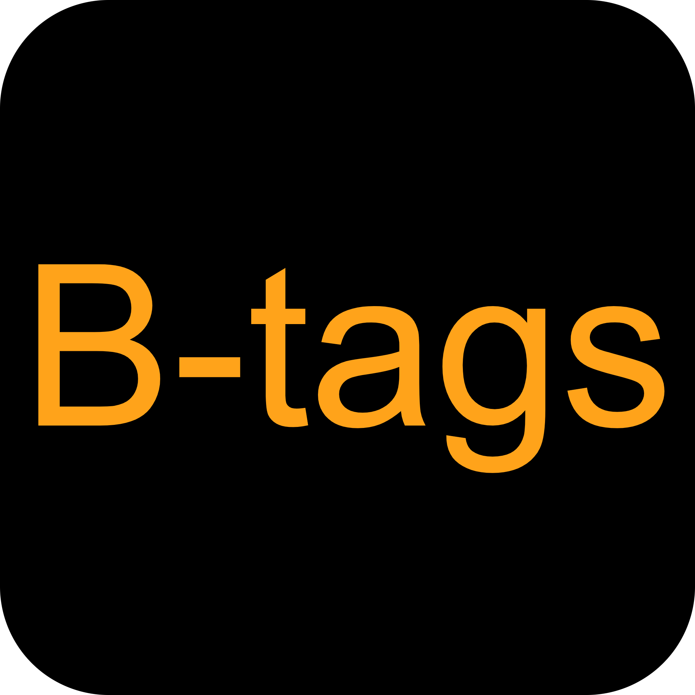

# B-tags

自媒体人如果想要优化自己的作品更容易上热门🔥那么选择一个好的视频标签很有必要😊

bilibili-hot-tags是一个根据关键词进行B站热门视频标签检索统计小工具🔧

这个工具可以帮助您输入视频关键词搜索B站热门视频标签🏷

<!-- PROJECT SHIELDS --

<!-- PROJECT LOGO -->

<br />

<p align="center">
  <a href="#">
    
  </a>

<h3 align="center">bilibili-hot-tags</h3>
  <p align="center">
    一个B站热门视频标签检索统计小工具
    <br />
    <a href="https://bilibili-hot-tags-git-master-ouzexis-projects.vercel.app/"><strong>点击进入 »</strong></a>
    <br />
    <br />
    <a href="https://github.com/ouzexi/bilibili-hot-tags/issues">报告Bug</a>
  </p>

</p>

 本篇README.md面向开发者

##### [后端仓库](https://github.com/ouzexi/bilibili-hot-tags-backend)

### 使用指南

进入网站，输入你想要检索标签的视频关键词。比如，您想获取【羽毛球教学】该类视频的视频标签，那么您可以输入关键词【羽毛球教学】，点击 “搜索🔍”按钮。

搜索完成后饼图会将使用次数最多的10个标签（比如【"羽毛球", "教学", "体育"...】）统计结果可视化展示。您就可以将这10个标签加入到您的视频当中~👀

##### **开发步骤**

1、克隆项目

```sh
git clone https://github.com/ouzexi/bilibili-hot-tags.git
```

2、下载依赖

```sh
npm install
```

3、启动项目

```sh
npm run dev
```

### 技术栈

#### 前端

- React
- TypeScript
- AntV G2

#### 后端

- Go
- Gin

#### 部署

- vercel

### 联系作者

[ouzexi](http://139.9.177.72/)

### 版权说明

该项目遵循MIT授权许可

### 特别鸣谢

- [bilibili-API-collect](https://github.com/SocialSisterYi/bilibili-API-collect)
